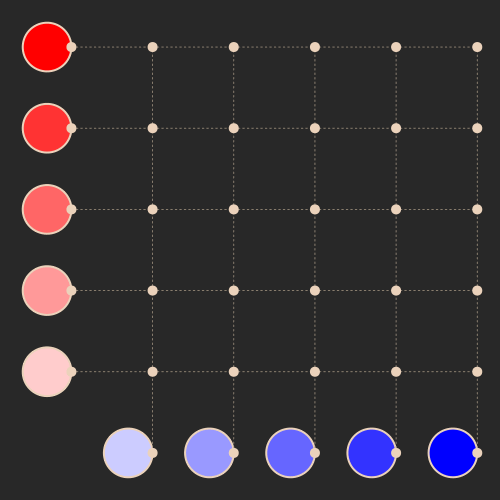

# Lissajous Curves

## Overview

This is a quick project using CairoMakie in Julia to reproduce an amination shown in Matt Parker's "Making a physical Lissajous curve" video [here](https://www.youtube.com/watch?v=4CbPksEl51Q)

CairoMakie is not designed for creating animations, one should really us GLMakie, however Julia is unable to accurately create animations on my computer, so I simply create a series of frames & then `convert` to an animation in the command line.

In the animation I wish to emulate, there are 5 circles on the left and top. A point on each circle rotates anticlockwise (at five different (integer) rates). From each leftwise circle a horizontal line at the circling point intersects the equivalent vertical lines from the topwise circles. Each intersection point maps out a lissajous curve. I draw the top circles at the bottom so that I can draw any number of circles. 

## Plan

I need to create the circles at the top and left. I will position them at `(-1, i)` and `(i, -1)` respectively for each circle. Each radius will be `0.3`.

After playing, I moved the drawers to `(0,i)` and `(i,0)` respectively.

Since I am dealing with vertical and horizontal lines I don't need to do any maths for the intersection points. I need the `x` coordinate of the bottom circle point and the `y` coordinate of the left circle point.

I then loop over 0 -> 2pi to draw the curves.

I have had some issues getting colours correct for the paths, so I wrote my own colour adding function that essentially just averages the two colours.

## Saving the animation

To reduce the amount of frames I generated all the curves in advance, and then looped through them 10 at a time. This way we maintain the resolution of the curves but reduce the frames. Essentially, 10 points are added to the curves at each point.

To save the animation I need to `convert` the frames to a gif. All frames are saved in `./frames`. I need to run:

```bash
convert -delay 1 -loop 0 'frames/*' test.gif
```


